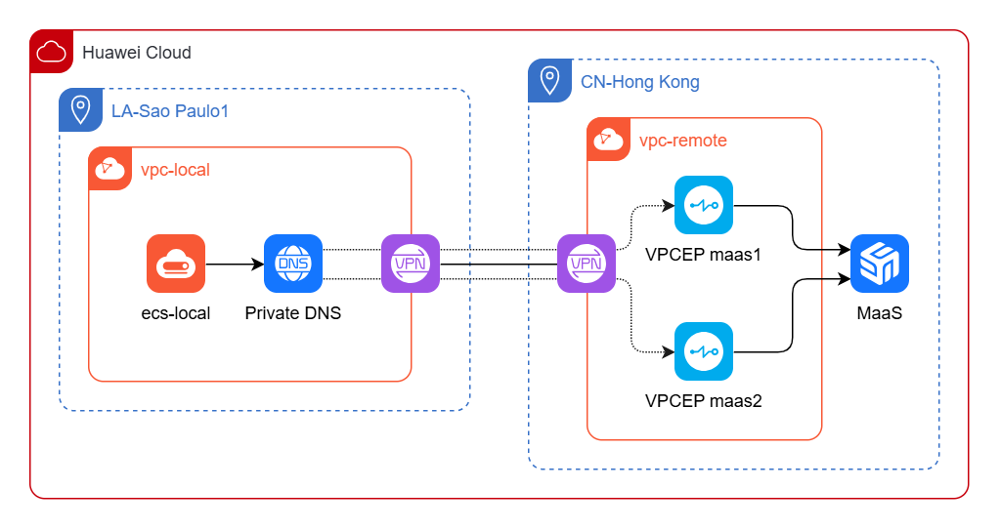

# Huawei Cloud MaaS Access Through a Private Network

This repository contains Terraform files to deploy Huawei Cloud infrastructure
required to access MaaS through a private network, according to the following
architecture:



The LA-Sao Paulo1 region simulates the local network and hosts the local ECS
instance. The local VPC connects to the CN-Hong Kong region through Enterprise
VPN.

In the CN-Hong Kong region, two VPC Endpoints are deployed to ensure high
availability for private access to MaaS. A private DNS zone is created in the
LA-Sao Paulo1 region and configured to resolve the MaaS API domain to the
private IP addresses of the two VPC Endpoints.

As a result, applications running on the local ECS can access the MaaS API
through the private network rather than through the public IP address. DNS
resolution returns the private IP addresses of the VPC Endpoints, allowing
clients to connect through either endpoint.

Reference documentation: <https://support.huaweicloud.com/intl/en-us/security-compliance-maas/security_0003.html>

## Requirements

- Huawei Cloud account
- AK/SK of an IAM User with permission to create the required VPC, ECS,
  Enterprise VPN, VPC Endpoint, and DNS resources
- Terraform installed
- MaaS GLM 5.2 model subscribed in the CN-Hong Kong region
- MaaS VPC Endpoint Service IDs for the CN-Hong Kong region
- Sufficient Huawei Cloud quota for the resources created by this example

## Deploy infrastructure

1. Make a copy of `terraform.tfvars.example` named `terraform.tfvars` and
   set AK, SK, passwords and MaaS service IDs;
2. Run `terraform init` the first time to download provider files;
3. Run `terraform plan` to check what will be done;
4. Run `terraform apply` to provision the infrastructure.

## Verify network connectivity

Log in to `ecs-local` and ping the MaaS domain to verify private connectivity
between local and remote networks. DNS resolution should return the private IP
addresses associated with the two VPC Endpoints over repeated queries. The
selected address may vary between requests.

```plain
root@ecs-local:~# ping -c 3 api-ap-southeast-1.modelarts-maas.com
PING api-ap-southeast-1.modelarts-maas.com (172.17.0.135) 56(84) bytes of data.
64 bytes from 172.17.0.135: icmp_seq=1 ttl=60 time=302 ms
64 bytes from 172.17.0.135: icmp_seq=2 ttl=60 time=302 ms
64 bytes from 172.17.0.135: icmp_seq=3 ttl=60 time=302 ms

--- api-ap-southeast-1.modelarts-maas.com ping statistics ---
3 packets transmitted, 3 received, 0% packet loss, time 2002ms
rtt min/avg/max/mdev = 301.568/301.620/301.723/0.072 ms
root@ecs-local:~#
root@ecs-local:~#
root@ecs-local:~# ping -c 3 api-ap-southeast-1.modelarts-maas.com
PING api-ap-southeast-1.modelarts-maas.com (172.17.0.31) 56(84) bytes of data.
64 bytes from 172.17.0.31: icmp_seq=1 ttl=60 time=302 ms
64 bytes from 172.17.0.31: icmp_seq=2 ttl=60 time=302 ms
64 bytes from 172.17.0.31: icmp_seq=3 ttl=60 time=301 ms

--- api-ap-southeast-1.modelarts-maas.com ping statistics ---
3 packets transmitted, 3 received, 0% packet loss, time 2003ms
rtt min/avg/max/mdev = 301.496/301.663/301.876/0.158 ms
```

ICMP packet loss may occur during the first few connectivity checks while the
VPN routes and endpoint connectivity become ready.

## Verify MaaS API access

Assuming you already have a MaaS API Key and subscribed to glm-5.2 model,
run the following commands to test MaaS access through private network:

```sh
# Read API Key to environment variable (and print an empty line)
read -rsp "Enter MaaS API Key: " MAAS_API_KEY && echo

# Call MaaS API
curl -X POST "https://api-ap-southeast-1.modelarts-maas.com/v2/chat/completions" \
  -H "Content-Type: application/json" \
  -H "Authorization: Bearer $MAAS_API_KEY" \
  -d '{
    "model": "glm-5.2",
    "messages": [
      {"role": "system", "content": "You are a helpful assistant."},
      {"role": "user", "content": "Introduce yourself."}
    ]
  }' \
  -w '\nServer IP: %{remote_ip}\n'
```

Expected output (see the `Server IP: 172.17.x.x` printed at the end, which
confirms MaaS was accessed through the private network):

```plain
root@ecs-local:~# curl -X POST "https://api-ap-southeast-1.modelarts-maas.com/v2/chat/completions" \
  -H "Content-Type: application/json" \
  -H "Authorization: Bearer $MAAS_API_KEY" \
  -d '{
    "model": "glm-5.2",
    "messages": [
      {"role": "system", "content": "You are a helpful assistant."},
      {"role": "user", "content": "Introduce yourself."}
    ]
  }'\
  -w '\nServer IP: %{remote_ip}\n'
{"id":"***","object":"chat.completion","created":***,"model":"glm-5.2","choices":[{"index":0,"message":{"role":"assistant","reasoning_content":"The user asked me to introduce myself. I should provide a clear and helpful introduction about who I am and what I can do.","content":"Hello! I'm an AI assistant created to help answer questions, provide information, and assist with a wide range of tasks. I can help with writing, analysis, coding, math, creative projects, and much more. Feel free to ask me anything you'd like help with!"},"finish_reason":"stop"}],"usage":{"prompt_tokens":23,"total_tokens":107,"completion_tokens":84,"prompt_tokens_details":{"cached_tokens":0},"completion_tokens_details":{"reasoning_tokens":27}},"service_tier":"default"}
Server IP: 172.17.0.31
root@ecs-local:~#
```

## Remove infrastructure

The VPN connections have a dependency cycle in the Terraform resource graph.
Destroy the two specified connections first to break the cycle, then destroy
the remaining resources:

```sh
terraform destroy \
  -target huaweicloud_vpn_connection.local1_to_remote1 \
  -target huaweicloud_vpn_connection.local2_to_remote2

terraform destroy
```
